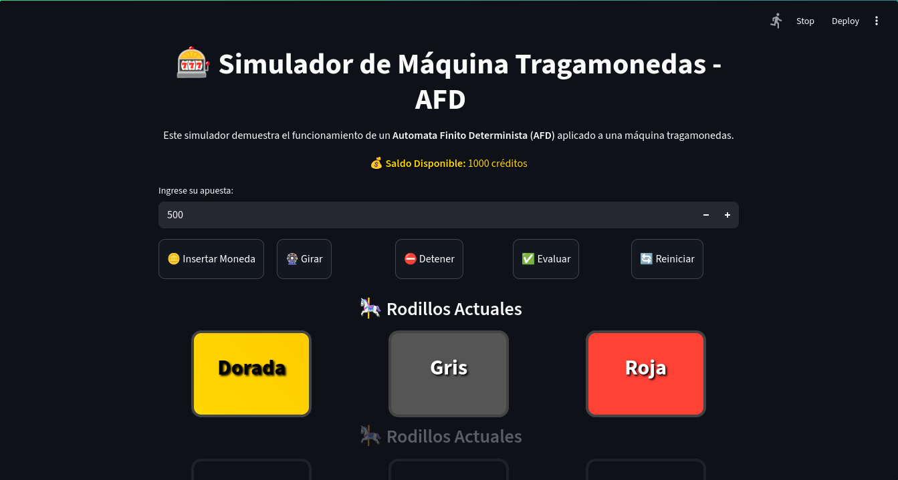

<h1 align='center'>🎰Automata Tragamonedas🎰</h1>
<p alig='center'>
  <em>Proyecto interactivo haciendo uso de un Automata Finito Determinista (DFA)</em><br>
  <strong>Desarrolloado en Python + Streamlit + Automatalib</strong>
</p>
<div align='center'>
    
</div>

---
## Descripción del Proyecto
Este proyecto implementa una **máquina tragamonedas** cuyo flujo de estados está controlado por un  
**Autómata Finito Determinista (DFA)**.  
Cada acción del jugador (insertar moneda, girar, detener, evaluar) provoca una transición entre estados.  

El sistema incluye:
- Transiciones visuales entre estados mediante imágenes generadas con **Graphviz**.
- Simulación de **probabilidades y recompensas** según el color de los tambores.
- Interfaz gráfica creada con **Streamlit**.
- Mecanismo de **ganancia y pérdida** según combinaciones obtenidas.
- Representación visual del **estado actual** del autómata.

---
## Instalación y Uso
1. Clonar este repositorio:
   ```bash
   got clone 'a'
   cd 'a'
2. Instalar dependencias
   ```bash
   pip install -r requirements.txt
3. Ejecutar la aplicación:
   ```bash
   streamlit run app.py
4. Abrí el navegador en http://localhost:8501 y probá la simulación

---
## Autores
- García Nehuén Agustín
- Valenciano Samuel
